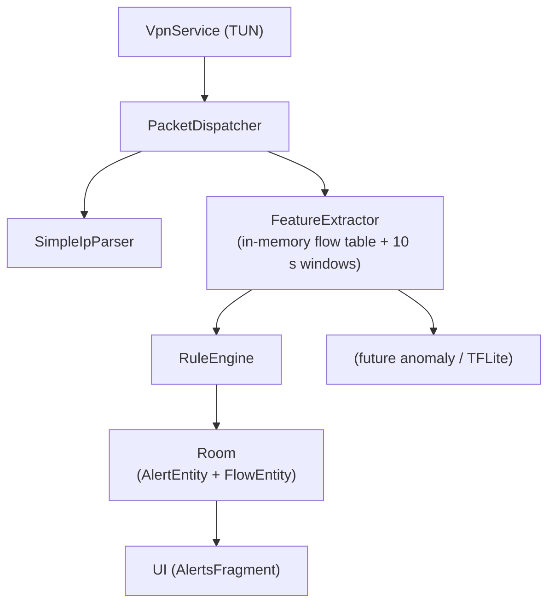

# Syrrak – On-Device Mobile Intrusion Detection System (Android)

Syrrak is a research prototype of a local, on-device Intrusion Detection System (mIDS) for Android. It intercepts the device’s own IP traffic using Android’s `VpnService` TUN interface, performs lightweight flow aggregation and feature extraction, applies rule-based detection, and stores alerts in a local Room database. A basic BLE scanner is also included.

The system does **not** act as a VPN, does not forward or route traffic externally, and does not send any data off-device by default.

## Core Capabilities (Implemented)

- **Local packet capture** via `VpnService` + TUN interface (IPv4). Traffic is read, parsed, and discarded; nothing is forwarded.
- **Lightweight parsing**: IPv4 header, protocol, source/destination addresses, and TCP/UDP ports.
- **Flow aggregation**: Packets are keyed by 5-tuple. Running statistics (packet count, byte count, inter-arrival times, unique destinations) are maintained in memory.
- **Windowed feature extraction**: Every 10 seconds the active flows are turned into feature vectors and passed to the detection engine. Flows idle for >60 s are pruned.
- **Rule engine** with the following starter rules:
  - High packet rate + low average inter-arrival time
  - Large number of unique destinations in a short window (scan indicator)
  - UDP/53 DNS query bursts
  - High rate of very small packets
- **Alert persistence**: Alerts (type, message, timestamp, confidence, JSON evidence) are written to a Room database and displayed in the UI.
- **BLE scanning**: Continuous low-level scan that reports new or strong-RSSI advertisers (currently logged; ready for future rule integration).
- **Foreground service** with persistent notification while capture is active.
- **Simple UI**: Start/Stop buttons + live list of the most recent 200 alerts.

## Architecture




BLE results currently feed a separate dispatcher and can be wired into the same feature/detection path later.

## Project Structure

```
app/src/main/
├── java/com/example/mids/
│   ├── App.kt                     # Application + notification channel
│   ├── net/
│   │   ├── CaptureVpnService.kt   # TUN capture + foreground service
│   │   ├── PacketDispatcher.kt
│   │   └── SimpleIpParser.kt
│   ├── feature/
│   │   └── FeatureExtractor.kt    # Flow table + window emission
│   ├── detection/
│   │   ├── DetectionPipeline.kt
│   │   └── RuleEngine.kt
│   ├── flow/
│   │   ├── AppDatabase.kt
│   │   ├── FlowEntity.kt
│   │   └── FlowDao.kt
│   ├── alerts/
│   │   ├── AlertEntity.kt
│   │   └── AlertDao.kt
│   ├── bt/
│   │   ├── BleScanner.kt
│   │   └── BluetoothFeatureDispatcher.kt
│   └── ui/
│       ├── MainActivity.kt
│       ├── AlertsFragment.kt
│       └── ForensicsFragment.kt   # stub
└── res/
    ├── layout/
    ├── values/
    └── xml/
```

## Requirements

- Android Studio Hedgehog / Ladybug or later
- JDK 17
- Android SDK 34
- Physical device recommended (API 26+). Emulator TUN support is limited and unreliable for realistic testing.
- Permissions requested at runtime:
  - `BIND_VPN_SERVICE` (system dialog)
  - `BLUETOOTH_SCAN` / `BLUETOOTH_CONNECT`
  - `ACCESS_FINE_LOCATION` (required by Android for BLE scan on many versions)
  - `POST_NOTIFICATIONS` (Android 13+)

## Building & Running

1. Clone or open the project root in Android Studio.
2. Let Gradle sync (dependencies: Room, Coroutines, Security Crypto, Material).
3. Select a physical device.
4. Run the app.
5. Tap **Start Capture**. Accept the VPN permission dialog.
6. Grant Bluetooth / location permissions if prompted.
7. Generate traffic on the device or from another host (see Testing section).
8. Alerts appear in the list. Tap **Stop Capture** to shut down the service cleanly.

The capture service runs as a foreground service with a low-importance notification. Stopping the service closes the TUN interface and cancels the coroutine job.

## Testing Suggestions

Controlled experiments that exercise the current rules:

- High-rate ICMP or UDP floods from another machine on the same network.
- Port scans (`nmap -sS <device-ip>`).
- Rapid DNS queries (e.g., a script that resolves many domains).
- BLE beacon spam from a second device or `hcitool`/`bluetoothctl` advertiser.

Baseline normal traffic (YouTube, messaging apps, etc.) first so that the simple rate-based rules do not fire on ordinary usage. The current rule thresholds are deliberately conservative and intended as starting points.

## Current Limitations

- IPv4 only; no IPv6, fragmentation reassembly, or deep packet inspection.
- No transport-layer reassembly or application-layer parsing beyond basic ports.
- Feature extraction and rules are purely statistical / threshold-based. No machine-learning models are present yet.
- Flow table and DB writes are not yet heavily optimised for sustained high packet rates or battery life.
- BLE results are collected but not yet fully integrated into the rule engine.
- Alert storage is plaintext Room (AndroidX Security Crypto is on the classpath for future encrypted file support).
- No pcap export or forensic packaging yet (ForensicsFragment is a stub).
- UI is minimal (ListView + two buttons).

These limitations are intentional for a research prototype focused on the capture → feature → rule pipeline.

## Roadmap

| Phase | Goal | Status |
|-------|------|--------|
| 0.1 | TUN capture, flow features, basic rules, Room, UI | Complete (this tree) |
| 0.2 | Battery/IO optimisation, better flow expiry, more robust service lifecycle | In progress |
| 0.3 | Optional on-device anomaly detection (Z-score or TFLite autoencoder) | Planned |
| 0.4 | Encrypted alert storage + sanitized export | Planned |
| 0.5 | iOS (NEPacketTunnelProvider) feasibility study | Planned |
| 1.0 | Hardened beta with improved UI and optional local telemetry | Future |

## Privacy & Security Principles

- All analysis stays on the device.
- No remote servers, analytics, or telemetry.
- TUN interface is used only for local observation; the system never becomes a VPN endpoint.
- Minimal permission set.
- Alerts and flow metadata remain in the private app database.

## Contributing

Bug reports and pull requests are welcome. Please:

- Keep changes focused and Kotlin-idiomatic.
- Add or update unit tests for parser / rule / feature logic where practical.
- Ensure the project still builds and the capture service starts/stops cleanly.
- Update this README when behaviour or structure changes.

## License

MIT License. See LICENSE file.


